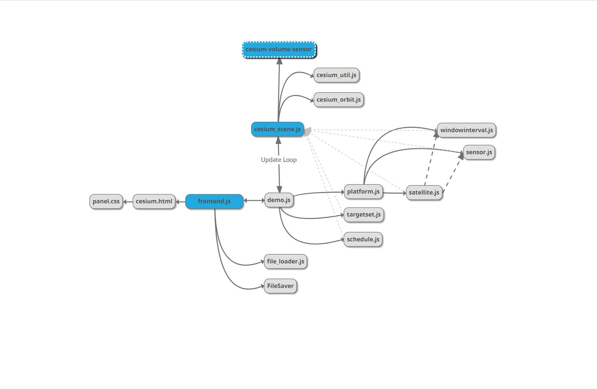

# Boson
>A web-app that visualizes collection schedules of orbiting
electro-optical/radar sensors.

## Dependencies
All dependencies are prebuilt and stored in `./js/build/`. These dependencies are either imported with a script tag in `index.html` or imported with ES6 modules.

#### Current Dependencies
- [Cesium 1.72](https://cesium.com/downloads/) *earth visualization*
- [MathDotSqrt/cesium-sensor-volumes](https://github.com/MathDotSqrt/cesium-sensor-volumes) *sensor visualization*
- [FileSaver.js](https://github.com/eligrey/FileSaver.js/) *saves BLOB as file*

## Deployment

`Boson` runs best on the newest version of chrome, but will run on any browser that supports ES6 and WebGL.

#### Hosting
Although `Boson` runs entirely on the front-end's browser, Cesium will not serve cross-origin requests unless it is hosted on a webserver. To run `Boson` the entire project folder needs to be on a webserver. The user can either host the webserver locally on a personal machine or host it remotely. If hosted locally you can access `Boson` via [localhost](http://localhost:8080/Boson/).

## Developer Guide

### Setup
To develop on Boson you will need the code repository, a web server, and a python interpreter with PIP.  

1. Download the code repository

  `git clone https://github.com/MathDotSqrt/Boson.git`

  A folder titled `Boson` should appear as the root directory for the project.
2. Download Tomcat

  Version [Apache Tomcat Version 10.0.0](http://mirrors.ibiblio.org/apache/tomcat/tomcat-10/v10.0.0-M7/bin/apache-tomcat-10.0.0-M7-windows-x64.zip). After it is unzipped there are two important folders `bin` and `webapps`. To host `Boson` on tomcat put its root directory in the `webapps` folder. To launch the webserver, run `startup.bat` within the `bin` folder.

  Now `Boson` should be hosted locally on http://localhost:8080/Boson/

  To host `Boston` remotely, complete the previous steps on a dedicated host machine. Get its IPv4 Address and use the IP address with port 8080 to access it same as before.

  Example: http://100.100.0.100:8080/Boson/

3. Install Python Interpreter

  TBD


### Classes

#### Scene
> defined in `cesium_scene.js`

`Scene` is a class that owns the WebGL visualization including Cesium's `Viewer`, `Entities` and `Primitives`.

```  javascript
class Scene{
  constructor(dom){}

  /* Visualization Timeline Controls */
  getCurrentTime();
  setCurrentTime(seconds);
  setStopTime(seconds);
  /* Visualization Timeline Controls */

  followEntity(name);
  addPreRenderEvent(simulation);

  /*Satellite Controls*/
  createOrbit(name, ephemeris);
  setOrbitWindows(name, none, onlyIW, onlyCW, both);
  setOrbitColor(name, csscolor, type);
  setOrbitTrail(id, trail);
  appendSensor(name, sensor_type, min, max);
  setSensorColor(id, sensor_type, css_color);
  removeOrbit(name);
  /*Satellite Controls*/

  /*Target Set Controls*/
  updatePrimitives();     //Force updates all primitives in the scene.
                          //Enables getGeometryInstanceAttributes on the first frame
  createTargetPrimitive(name, target_set);
  setTargetColor(id, css_color, alpha=.5);
  setTargetSelectColor(id, css_color);
  selectTarget(name, target_id);
  deselectTarget(name, target_id);
  removeTargetPrimitive(name);
  /*Target Set Controls*/

  /*Target Collection Visualization Controls*/
  fireVector(name, lon, lat);
  iceVector(name);
  clearAllVectors();
  /*Target Collection Visualization Controls*/

}
```

#### Simulation
> defined in `demo.js`

`Simulation` is a class that represents the current state of the visualization. This class handles importing and serialization of visualization state. The primary function of this class it to guarantee any changes made to the UI will be represented in cesium's `Scene` class. Simulation and its children does not own any cesium entities or primitives. This state ownership architecture designed to work well with including additional visualization libraries. `Simulation` owns:
  - `Scene`
  - `Platform`
  - `TargetSet`
  - `Schedule`

``` javascript
class Simulation{
  constructor(dom){} //DOM is the html element for Cesium to put canvas in

  follow(name);
  setVisualizationTime(seconds);

  /*Platform Controls*/
  importPlatform(name, platform);
  getAllPlatformNames();
  importSensors(sensor_names, sensors);
  importWindow(window, isIW=true);
  setOrbitColor(name, color);
  setOrbitTrail(name, values);
  removeAllOrbits();
  /*Platform Controls*/

  /*Target Set Controls*/
  importTargetSet(name, targets);
  setTargetColor(name, color, alpha);
  setTargetSelectColor(name, color);
  removeTargetSet(name);
  removeAllTargetSets();
  /*Target Set Controls*/

  /*Schedule Controls*/
  importSchedule(name, schedule);
  removeSchedule();
  nextScheduleEvent();
  prevScheduleEvent();
  /*Schedule Controls*/

  toJSON(); //Serializes entire visualization state
}
```

#### Platform
> defined in `platform.js`

`Platform` is a class that owns every satellite in the scene. Platform owns:
- `Satellite`

``` javascript
class Platform {
  constructor(name, platform, scene){}
  addSensors(name, sensors);
  setOrbitColor(name, color);
  setOrbitTrail(name, value);
  setAllOrbitTrail(value);

  setWindow(window_name, intervals, isIW);
  removeAll();

  getSatelliteByName(name);
  getSatelliteByID(id);
  getAllSatelliteNames();
  getMaxTime();             //Gets max ephemeris from all satellites

  get name();               //Name of the platform file

  toJSON();                 //Serialize the sate of all the satellites in the platform
  update();                 //Update all satellites
}
```

#### Satellite
> defined in `satellite.js`

`Satellite` represents the state of an orbiting satellite in cesium's visualization. A satellite optionally defines its sensor. Satellite owns:
  - `Sensor`
  - `WindowInterval`

``` javascript
class Satellite {
  constructor(satellite, scene){}

  get name();
  get id();

  get color();
  set color(new_color);

  get orbit_trail();
  set orbit_trail(trail_name);

  get sensor();
  set sensor(sensor);

  get window();

  getMaxTime();

  toJSON();                   //Serialize the state of the satellite
  update();
}
```

#### Sensor
> defined in `sensor.js`

`Sensor` represents the state of the satellite's sensor volume in the Cesium visualization. Cesium visualizes sensor volumes with the library `cesium-volume-sensor`. This class is not dynamic.

```javascript
class Sensor{
  constructor(name, type, min_value, max_value, scene){}


  //Note: only getters. This class is not dynamic
  get sensor_type();
  get min_value();
  get max_value();
}
```

#### WindowInterval
> defined in `windowinterval.js`

`WindowInterval` represents the Imaging Window (IW) and Communication Window (CW) intervals for an individual satellite's orbit. When both intervals are defined, the class will compute 4 non-overlapping interval sets.
  - `this._complInterval` complement of (IW or CW) intervals *(default satellite color)*
  - `this._mutexIWInterval` mutually exclusive image window interval *(red)*
  - `this._mutexCWInterval` mutually exclusive comm window interval *(blue)*
  - `this._mutinInterval` mutually inclusive intervals for (IW and CW) *(purple)*

```javascript
class WindowInterval{
  constructor(parent, scene){}   //Parent is the satellite this window interval is attached to

  setIWInterval(interval);
  setCWInterval(interval);


  isComputed();                 //Tests if all four intervals are computed


  /*Interval Color Controls*/
  //The UI is not hooked up to these controls yet, but they do work.
  set DefaultColor(color);
  get DefaultColor();
  set IWColor(color);
  get getIWColor();
  set CWColor(color);
  get CWColor();
  set BothColor(color);
  get BothColor();
  /*Interval Color Controls*/

  //Four non overlapping intervals
  get complInterval();
  get mutexIWInterval();
  get mutexCWInterval();
  get mutinInterval();
}
```

#### TargetSet
> defined in `targetset.js`

`TargetSet` represents a collection of related target regions in Cesium's primitive visualization

```javascript
class TargetSet{
  constructor(targets, scene){}

  get name();
  get color();
  set color(color);

  get alpha();
  set alpha(alpha);

  get selectColor();
  set selectColor(selectColor);

  selectTargetByID(id);
  deselectTargetByID(id);

  toJSON();   //Serialize all targets in the scene and their state
}
```

#### Schedule
> defined in `schedule.js`

`Schedule` represents time-series collection events for each satellite individually. Every visualization timestep queries `Schedule` to get the current event and an array of skipped events for each satellite.

```javascript
class Schedule{
  constructor(name, schedule){}

  get schedule();

  //Everytime getScheduleEventContinuous is called, Schedule caches the last event for substantial efficiency gains
  //When visualization state changes, its important to clear the last cache.
  clearLastEventCache();


  getAllPlatformIDs();  //All of the platformIDs referenced in the schedule
  getAllTargets();      //All of the targetIDs referenced in the schedule

  //Gets the current event and an array of skipped events for each satellite
  getScheduleEventContinuous(seconds);

  //If satellite is defined, get next event for specific satellite. If not defined get next closest event.
  getNextEventTime(seconds, satellite);
  getPrevEventTime(seconds satellite);


  getMaxTime();       //Gets largest time value from all schedule events

  toJSON();           //Serializes schedule events  
}
```

### More Important Files
  - `boson_style.css` is the base CSS of `Boson`
  - `index.html` is the base HTML of `Boson`
  - `frontend.js` is a collection of functions that add event listeners to html elements and make the UI dynamic
  - `file_loader.js` is a collection of functions that read and parse files into JSON asynchronously. When files are successfully parsed they trigger a callback

### Code Diagram
> The arrow represents the direction of the calling code.



---

### Code Snippets

#### Common Pattern for Parsing CSV
Boson's main input file type is CSV. A common pattern used to parse CSV files is generating an index map from the header.  

A user will create a `columnMap` with programmer name as the key and the CSV column name as the value.

```javascript
const columnMap = {
  platformID : "PlatformID",
  time : "Time",
  posx : "PositionX",
  posy : "PositionY",
  posz : "PositionZ",
  velx : "VelocityX",
  vely : "VelocityY",
  velz : "VelocityZ"
}
```
`getHeaderIndices` will return an index map with the same keys as columnMap and with the column indices as the value. Returns null if column name was not found.
```javascript
const indexMap = getHeaderIndices(header, columnMap);

if(indexMap === null){
  return null;
}
```
`indexMap` is now used to index into the line split array.
```javascript
const split = line.split(',');
...
ephemeris.time.push(Number(split[indexMap.time]));
//convert km to meters
ephemeris.position.push(Number(split[indexMap.posx]) * 1000);
ephemeris.position.push(Number(split[indexMap.posy]) * 1000);
ephemeris.position.push(Number(split[indexMap.posz]) * 1000);

ephemeris.velocity.push(Number(split[indexMap.velx]) * 1000);
ephemeris.velocity.push(Number(split[indexMap.vely]) * 1000);
ephemeris.velocity.push(Number(split[indexMap.velz]) * 1000);
```

---
#### Orienting Satellite Sensor Volumes
When orienting the satellite's sensor-volume with the `velOrientation` entity property, the volume points 180 degrees away from the surface of the earth.

```javascript
const current_orientation = entity.velOrientation.getValue(time); //calculated velocity orientation
const orientation = entity.orientation.getValue();                //current orientation of entity

//points sensor to surface of the earth
//rotate sensor 180 degrees along the axis of its velocity
const vel_axis = Cesium.Cartesian3.normalize(velocity, temp0_vec3);
const rotate_down_quat = Cesium.Quaternion.fromAxisAngle(vel_axis, Math.PI, temp0_quat);
Cesium.Quaternion.multiply(rotate_down_quat, current_orientation, orientation); //orientation now facing earth surface
```    
The code to rotate the sensor volume on the axis perpendicular to the surface of the earth.
```javascript
//not accurate in Wgs84 because it measures from center of earth not
//orthogonal from surface of earth
const pos_axis = Cesium.Cartesian3.normalize(position, temp0_vec3);       
const offset_rotation = 0;                                                      //in radians
const offset_quat = Cesium.Quaternion.fromAxisAngle(pos_axis, offset_rotation, temp0_quat);
Cesium.Quaternion.multiply(offset_quat, orientation, orientation);
```
Final orientation.
```javascript
entity.orientation.setValue(orientation);
```
---

#### Target Select Shader
This is a modified version of EllipsoidSurfaceAppearance vertex shader. The only modification was adding the color attribute and passing it to the fragment shader. This color attribute is a value passed to each vertex in the shader. The color attribute's alpha value is used in the fragment shader to decide whether to sample from a default color uniform or from a selected color uniform. This is done for performance reasons

#### Vertex Shader
```glsl
attribute vec3 position3DHigh;
attribute vec3 position3DLow;
attribute vec2 st;
attribute vec4 color;         //added color attribute
attribute float batchId;
varying vec3 v_positionMC;
varying vec3 v_positionEC;
varying vec2 v_st;
varying vec4 v_color;         //define fragment variable for color attribute
void main() {
  vec4 p = czm_computePosition();
  v_positionMC = position3DHigh + position3DLow;
  v_positionEC = (czm_modelViewRelativeToEye * p).xyz;
  v_st = st;
  v_color = color;            //apply vertex color attribute to fragment
  gl_Position = czm_modelViewProjectionRelativeToEye * p;
}
```

#### Fabric Source

[Frabric](https://github.com/CesiumGS/cesium/wiki/Fabric) lives in the fragment shader. A custom material is defined with this source to color the fragment. The v_color attribute was passed from the vertex shader and is used to select which uniform color to use.
```glsl
varying vec4 v_color;         //fragment color attribute from vertex shader
czm_material czm_getMaterial(czm_materialInput materialInput){
  czm_material m = czm_getDefaultMaterial(materialInput);
  m.diffuse = v_color.a > .5 ? select.rgb : color.rgb;
  m.alpha = v_color.a > .5 ? select.a : color.a;
  return m;
}
```

#### Defining the custom Target Select Shader
``` javascript
export function create_material(){
  const material = new Cesium.Material({
    fabric : {
      uniforms : {
        color : new Cesium.Color(1, 1, 0, 1),
        select : new Cesium.Color(1, 0, 1, 1)
      },
      source : fabric_source
    }
  });

  const appearance = new Cesium.EllipsoidSurfaceAppearance({
    flat : true,
    vertexShaderSource : vertexSource,
    //fragmentShaderSource : fragmentSource,  //no need for a custom fragment shader
    material : material,
  });

  return appearance;
}
```
